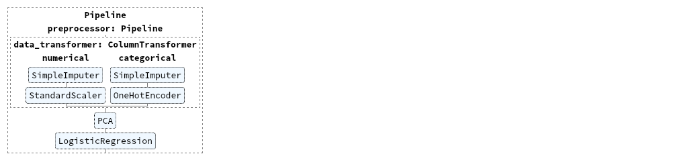

**1_Part - архитектура pipeline для одной модели**

В этом уроке показано, как сделать архитектуру конвейера с обработкой нескольких групп признаков,
использовать grid_search_cv, а также получить полную информацию о построенной модели

Ниже показано, какой будет визуализация конвейера.

